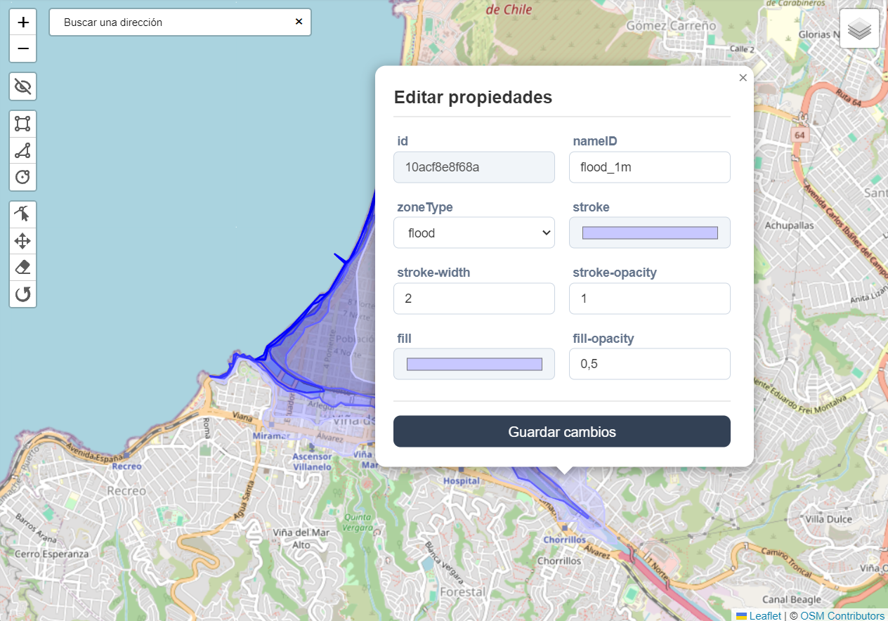
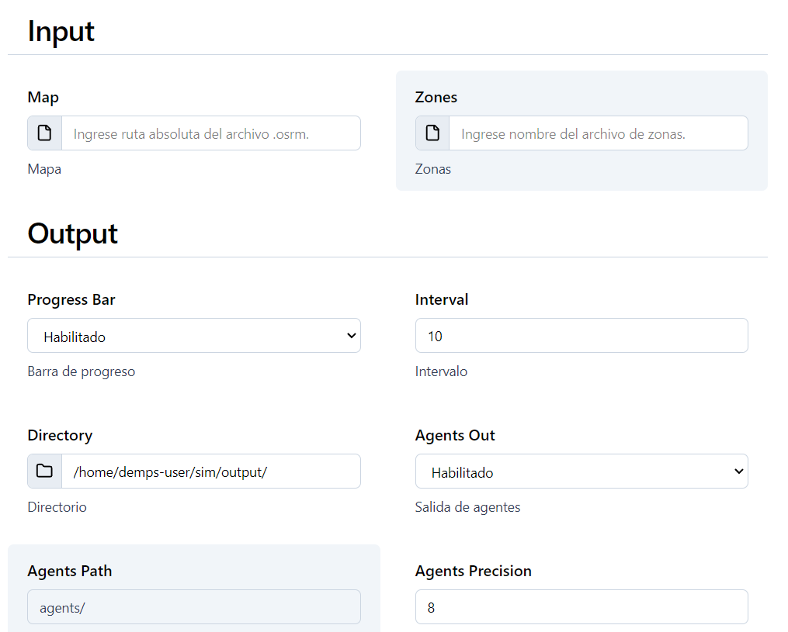

# Entorno

## Popups del mapa

Los popups del mapa aparecen en pantalla tras hacer click en una zona geográfica. Estos popups contienen un formulatio con los atributos y propiedades de la zona seleccionada.



A continuación se datalla información para editar el formulario que aparece en cada uno de estos popups.

### Definición de Tipos

```typescript
type InputPopupField = {
	type: HTMLInputTypeAttribute;
	defaultValue: string | number | boolean;
	attributes: HTMLInputAttributes;
};

type SelectPopupField = {
	type: 'select';
	defaultValue: string | number;
	attributes: HTMLSelectAttributes;
	options: string[];
};

type PopupFields = Record<string, InputPopupField | SelectPopupField>;
```

### Configuración de Campos

Los campos del formulario se definen en el objeto `popupFields`. Cada campo tiene una clave única y una configuración específica.

#### Ejemplo de Configuración

```typescript
const popupFields = {
	nameID: {
		type: 'text',
		defaultValue: '',
		attributes: {}
	},
	'fill-opacity': {
		type: 'number',
		defaultValue: 0.2,
		attributes: {
			min: 0,
			max: 1,
			step: 0.1
		}
	},
	zoneType: {
		type: 'select',
		defaultValue: '',
		attributes: {},
		options: ['initial', 'flood', 'safe']
	}
} satisfies PopupFields;
```

### Modificación del Formulario de Popups

Para añadir, modificar o eliminar campos en el formulario de popups:

1. Abra el archivo de configuración que se encuentra en `src/lib/config.ts`.
2. Para añadir un nuevo campo, agregue una nueva entrada siguiendo el formato existente.
3. Para modificar un campo, cambie los valores de `type`, `defaultValue`, `attributes`, u `options` (para campos de tipo 'select').
4. Para eliminar un campo, simplemente borre la entrada correspondiente.

#### Ejemplo de Modificación

```typescript
# src/lib/config.ts

const popupFields = {
	// ... campos existentes ...
	newField: {
		type: 'text',
		defaultValue: 'Nuevo campo',
		attributes: {
			placeholder: 'Ingrese un valor'
		}
	},
	// Modificación de un campo existente
	'fill-opacity': {
		type: 'number',
		defaultValue: 0.5, // Cambiado de 0.2 a 0.5
		attributes: {
			min: 0,
			max: 1,
			step: 0.05 // Cambiado de 0.1 a 0.05
		}
	}
} satisfies PopupFields;
```

Asegúrese de que la variable `popupFields` siga cumpliendo con el formato de `PopupFields` después de hacer cambios.

# Parametros

## Formulario de Parámetros de Simulación

Los campos del formulario de parámetros son creados a partir de un objeto de configuración, lo cual permite ajustar los tipos de entrada, las validaciones y los valores predeterminados según las necesidades específicas.



### Estructura General

El formulario se basa en el tipo `ParametersSchema`, que es la representación del schema original de la configuración de parámetros que recibe el simulador.

```typescript
type ParametersSchema = {
	duration: number;
	calibration: number;
	quadSize: number;
	closeEnough: number; //float
	randomWalkwayRadius: number; //float
	attractionRadius: number; //float
	deltaT: number; //float
	threads: number;
	floodModelEnable: boolean;
	densityModelEnable: boolean;
	panicModelEnable: boolean;
	elevationModelEnable: boolean;
	debrisModelEnable: boolean;
	city: string;
	description: string;
	samplingInterval: number;
	input: {
		map: string;
		zones: string;
	};
	output: {
		progressBar: boolean;
		interval: number;
		directory: string;
		'agents-out': boolean;
		'agents-path': string;
		'agents-precision': number;
		'agents-sufix': string;
		'stats-out': boolean;
		'stats-interval': number;
		'stats-path': string;
		'anim-config': string;
		'heatMap-out': boolean;
		'heatMap-size': number;
		'heatMap-interval': number;
		'heatMap-path': string;
	};
	floodParams: {
		direction: string; //N->S;W->E
		sampleStateInterval: number;
		arrivalTime: number; //negative
		speedWaterProp: number; //float
		speedWaterLevel: number; //float
		criticalLevel: number; //float
		minSpeedFactor: number; //float
		imagesEnable: boolean;
		imagesDir: string;
		stateEnable: boolean;
		stateDir: string;
	};
	densityParams: {
		minDensity: number; //float
		maxDensity: number; //float
		minVelocity: number; //float
	};
	agents: Agent[];
};

type Agent = {
	model: 'Residents' | 'Visitors';
	number: number;
	responseTime: {
		tau: number;
		sigma: number;
	};
	phoneUse: {
		meanTimeTakePhone: number; //float
		probPhoneUseConst: number;
	};
	ageRange: {
		G0: {
			prob: number; //float
			minSpeed: number; //float
			maxSpeed: number; //float
		};
		G1: {
			prob: number; //float
			minSpeed: number; //float
			maxSpeed: number; //float
		};
		G2: {
			prob: number; //float
			minSpeed: number; //float
			maxSpeed: number; //float
		};
		G3: {
			prob: number; //float
			minSpeed: number; //float
			maxSpeed: number; //float
		};
	};
	SFM: {
		timeRelax: number; //float
		sigma: number; //float
		repulsiveForceAgents: number; //float
		cosphi: number; //negative float
	};
	panicModel: {
		emotionThreshold: number; //float
		probInfectedToRecovered: number; //float
		probRecoveredToSusceptible: number; //float
		meanTimeInInfected: number;
		sdTimeInInfected: number; //float
		meanTimeInRecovered: number;
		sdTimeInRecovered: number; //float
	};
};
```

### Implementación del Formulario

Para poder representar cada uno de estos valores como campos HTML en un formlario, se diseñó la estructura descrita en `FormSchema`. La cual permite describir los atributos y propiedades de cada uno de estos valores.

```typescript
type FetchDirectoryOptions = Partial<{
	extensions: string[] | null;
	includeFiles: boolean;
	includeFolders: boolean;
}>;

type PathPickerProps = {
	isFile?: boolean;
	basePath?: string;
	initialPath?: string;
	validation?: ZodType;
	isRelativeTo?: string;
	onSelected?: () => void;
	disableBacktracking?: boolean;
	saveFileExtension?: string;
} & FetchDirectoryOptions;

type FormFieldProps =
	| { type: 'input'; attributes: HTMLInputAttributes & { type: 'text' | 'number' } }
	| { type: 'select'; attributes: HTMLSelectAttributes; options: SelectOptions }
	| {
			type: 'explorer';
			attributes: HTMLInputAttributes;
			props: Omit<Omit<PathPickerProps, 'onSelected'>, 'validation'>;
	  };

type FormField = {
	label: string;
	description?: string;
	validation?: ZodType;
} & FormFieldProps;

type FormSchema = Record<string, FormField[] | Record<string, FormField[]>>;
```

#### Ejemplos de Implementación

- Campo de entrada numérico

```typescript
duration: {
  label: 'Duration',
  description: 'Duración de la simulación',
  type: 'input',
  attributes: {
    name: 'duration',
    type: 'number',
    value: 3600,
    placeholder: 'Ingrese la duración de la simulación'
  },
  validation: nonEmpty()
}
```

- Campo de selección (booleano)

```typescript
floodModelEnable: {
  label: 'Flood Model Enable',
  description: 'Modelo de inundación',
  type: 'select',
  options: [
    { value: true, label: 'Habilitado' },
    { value: false, label: 'Deshabilitado', selected: true }
  ],
  attributes: {
    name: 'floodModelEnable'
  },
  validation: nonEmpty()
}
```

- Campo de explorador de archivos

```typescript
'input.map': {
  label: 'Map',
  description: 'Mapa',
  type: 'explorer',
  attributes: {
    name: 'input.map',
    placeholder: 'Ingrese ruta absoluta del archivo .osrm.'
  },
  props: {
    isFile: true,
    includeFolders: false,
    extensions: ['.osrm'],
    initialPath: joinPath(PUBLIC_BASE_DIR, 'planet.openstreetmap.org/chile/')
  },
  validation: nonEmpty()
}
```

### Modificación del Archivo de Configuración

Para modificar el archivo de configuración, siga estos pasos:

1. Abra el archivo de configuración que se encuentra en `src/lib/config.ts`.
2. Localice la sección correspondiente a los parámetros de simulación.
3. Modifique los valores según sea necesario.

#### Ejemplo de modificación:

```typescript
# src/lib/config.ts

export const simulationParameters: ParametersSchema = {
	duration: 7200, // Cambiado de 3600 a 7200
	calibration: 1.5,
	quadSize: 10,
	// ... otros parámetros ...
	floodModelEnable: true // Cambiado de false a true
	// ... resto de la configuración ...
};
```
